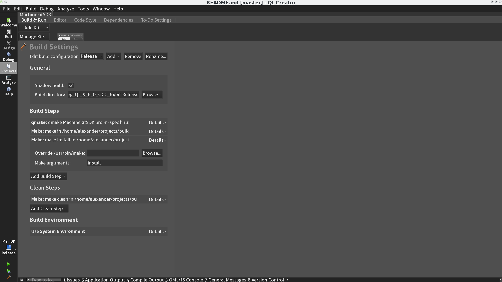

# MachinekitSDK

Qt Creator extension for creating [QtQuickVcp](https://github.com/strahlex/QtQuickVcp)
and [Machinekit](https://github.com/strahlex/machinekit) applications

## Contents
* <a href="#install">Installing the Machinekit SDK</a>
* <a href="#use">Using the Machinekit SDK</a>

<a name="install">
## Installing the Machinekit SDK
There are several ways to install the MachinekitSDK.

### Easy way - Vagrant
The easiest way to get a running MachinekitSDK, QtQuickVcp and Machinekit installation is to use
the [Vagrant configuration](https://github.com/strahlex/machinekit-vagrant). Follow the steps provided
in the repository and you will have a working installation with a few clicks.

### Prerequisites
Before continuing with this guide please install:

* [QtQuickVcp](https://github.com/strahlex/QtQuickVcp)
* [Machinekit](https://github.com/strahlex/machinekit)

Please follow the project specific steps.

### Clone the Git repository
Clone the [MachinekitSDK Git repository](https://github.com/strahlex/MachinekitSDK)

    git clone https://github.com/strahlex/MachinekitSDK.git

### Install with QtCreator
* To install the MachinekitSDK using QtCreator open the `MachinekitSDK.pro` project file.
* Then open the **Projects** register on the left side and add an additional **Build Step > Make**.
* In the **Make arguments** edit enter `install`. Next hit the build button (Ctrl+Shift+B).
* Restart QtCreator and you should find the Machinekit register in the **File > New File or Project..** menu.



### Install from terminal
Run the `install.sh` file with the QtSDK dir as argument:

```bash
./install.sh ~/bin/Qt
```

### Setup QtCreator
After you have built the MachinekitSDK you need to do the following steps (after a restart of QtCreator) in order to enable all the features:

- Enable the Qbs QtCreator plugin
- *Enable the BBIOConfig QtCreator plugin* - **Note:** this feature is currently disabled
- Add a remote Linux Target

Watch this video for a tutorial:

[](http://www.youtube.com/watch?v=L-nyk7UUEUU)
### Optional - BBIOConfig Plugin
The BBIOConfig plugin has been disabled since plugin infrastructure of
QtCreator has changed. If you still want to try your luck please follow these instructions:

Download the Qt Creator sources. Replace the **version** with the Qt Creator version you have installed **e.g. v3.1.0**

    cd ~/bin
    git clone https://github.com/qtproject/qt-creator.git
    cd qt-creator
    git checkout <version>

Next you have to modify the two paths concerning Qt Creator in the file *paths.pri* inside the QtQuickVcp directory:

    QTCREATOR_SOURCE_DIR=<path to Qt Creator source>
    QTCREATOR_INSTALL_DIR=<path to Qt SDK>/Tools/QtCreator/


Build and install the project:

Open the `MachinekitSDK.pro` file in Qt Creator, select the Desktop version of Qt you have installed. Then go the Projects register and add a custom make command `install`. Now you are ready to build the project in Release mode.

<a name="use">
# Using the Machinekit SDK
Please take a look at the following tutorials on YouTube:

[</br>Building Qt5 UIs with the MachinekitSDK](https://www.youtube.com/watch?v=IdB5769JtqI&feature=youtu.be)

[</br>HelloWorld in QtQuickVcp](http://www.youtube.com/watch?v=hyY1DoJ3mOA)

More detailed videos for specific areas will follow.


